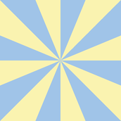

# Pinwheel Room Transition

A drop-in **pinwheel wipe** transition between GameMaker rooms for
[gmx](https://github.com/) projects. A rotating angular wedge sweeps across the
screen, revealing the new room over the old one.



## Usage

Call `room_goto_transition_pinwheel` anywhere you would normally call
`room_goto`:

```gml
// Transition to rm_level2 over 1.5 seconds (default spin speed).
room_goto_transition_pinwheel(rm_level2, 1.5);

// Faster spin.
room_goto_transition_pinwheel(rm_level2, 1.5, 4.0);
```

| Parameter | Type        | Description                                      |
|-----------|-------------|--------------------------------------------------|
| `room`    | `Room`      | The target room to transition to.                |
| `time`    | `Real`      | Duration of the transition, in seconds.          |
| `speed`   | `Real`      | *Optional.* Spin speed of the pinwheel (default `2.0`). |

Calls made while a transition is already running are ignored.

## How it works

`room_goto_transition_pinwheel` spawns a persistent driver object
(`obj_transition_pinwheel`). On the first frame it captures the current room
into a surface, then calls `room_goto` to the target. On the next frame it
captures the target room into a second surface. From then until `time`
elapses, it composites the two surfaces through `shdr_pin_wheel`, feeding a
`progress` uniform that ramps `0 → 1`. When the duration is reached it frees
its surfaces and destroys itself.

Because the driver is **persistent**, it survives the `room_goto` and keeps
drawing the blend in the new room. The composite is drawn in the
`Draw GUI End` event so it sits on top of everything.

## Contents

| Resource | Role |
|---|---|
| `scripts/scr_transition_pinwheel` | Public API — `room_goto_transition_pinwheel` |
| `objects/obj_transition_pinwheel` | Persistent driver that captures rooms and composites |
| `shaders/shdr_pin_wheel` | GLSL ES 3.00 pinwheel fragment shader |

## Demo

The bundled demo (`rm_demo` ↔ `rm_demo_b`) shows two contrasting rooms; press
**SPACE** to pinwheel between them. The demo room, its driver object, and the
rooms are demo-only and are not imported when you add this prefab.

## License

MIT — see [`LICENSE`](LICENSE). Copyright © 2021 Opera Norway AS.

## Credits

The pinwheel shader (`shdr_pin_wheel`) is adapted from
[`pinwheel.glsl`](https://github.com/gl-transitions/gl-transitions/blob/master/transitions/pinwheel.glsl)
by **Mr Speaker**, from the
[gl-transitions](https://github.com/gl-transitions/gl-transitions) project
(MIT). The full third-party notice is in [`LICENSE`](LICENSE).
